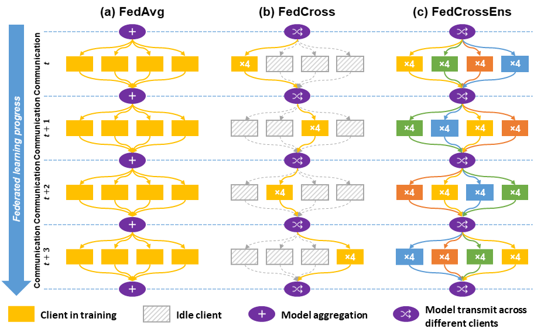

# FedCross
Federated Cross Learning for Medical Image Segmentation

This is a python (PyTorch) implementation of **Federated Cross Learning (FedCross)** method proposed in our preprint paper [**"Federated Cross Learning for Medical Image Segmentation"**](https://arxiv.org/abs/2204.02450).

## Citation
  *X. Xu, T. Chen, H. H. Deng, T. Kuang, J. C. Barber, D. Kim, J. Gateno, P. Yan, and J. J. Xia, "Federated Cross Learning for Medical Image Segmentation," 2022, arXiv:2204.02450.*

    @article{Xu2022FedCross, 
      title={Federated Cross Learning for Medical Image Segmentation}, 
      author={Xu, Xuanang and Chen, Tianyi and Deng, Hannah H. and Kuang, Tianshu and Barber, Joshua C. and Kim, Daeseung and Gateno, Jaime and Yan, Pingkun and Xia, James J.}, 
      journal={arXiv preprint arXiv:2204.02450}, 
      year={2022}, 
    }

## Abstract
Federated learning (FL) can collaboratively train deep learning models using isolated patient data owned by different hospitals for various clinical applications, including medical image segmentation. However, a major problem of FL is its performance degradation when dealing with data that are not independently and identically distributed (non-iid), which is often the case in medical images. In this paper, we first conduct a theoretical analysis on the FL algorithm to reveal the problem of model aggregation during training on non-iid data. With the insights gained through the analysis, we propose a simple yet effective method, federated cross learning (FedCross), to tackle this challenging problem. Unlike the conventional FL methods that combine multiple individually trained local models on a server node, our FedCross sequentially trains the global model across different clients in a round-robin manner, and thus the entire training procedure does not involve any model aggregation steps. To further improve its performance to be comparable with the centralized learning method, we combine the FedCross with an ensemble learning mechanism to compose a federated cross ensemble learning (FedCrossEns) method. Finally, we conduct extensive experiments using a set of public datasets. The experimental results show that the proposed FedCross training strategy outperforms the mainstream FL methods on non-iid data. In addition to improving the segmentation performance, our FedCrossEns can further provide a quantitative estimation of the model uncertainty, demonstrating the effectiveness and clinical significance of our designs. Source code is publicly available at [https://github.com/DIAL-RPI/FedCross](https://github.com/DIAL-RPI/FedCross).

## Method
### Training schemes of (a) FedAvg, (b) FedCross, and (c) FedCrossEns

## Contact
You are welcome to contact us:  
  - [xux12@rpi.edu](mailto:xux12@rpi.edu)(Dr. Xuanang Xu)  
  - [superxuang@gmail.com](mailto:superxuang@gmail.com)(Dr. Xuanang Xu)